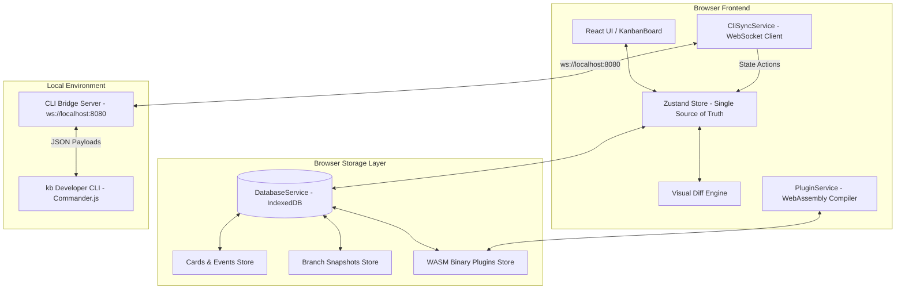

# KanbanLight: The Git-Paradigm Project Board


> **Imagine if Trello worked like Git.** KanbanLight allows you to "branch" your project board, experiment with new tasks, and instantly see a visual diff of what changed before merging it back to main. It brings the power of distributed version control, time-travel state hydration, sandboxed WebAssembly plugins, and a real-time developer CLI to project management.

---

## ✨ Core "Magic" Features

### 🌿 Time-Travel State & Branching

- **Non-Destructive Experimentation**: Spin up separate board branches (e.g. `experimental`, `sprint-2`) without affecting your primary board.
- **IndexedDB Snapshots**: Complete board state serialization (`cards`, `columns`, `events`) saved to browser storage for instant time-travel switching and hydration.

### 🔍 Visual Git Diffs

- **Comparative Branch Review**: Compare your current active branch against any target branch (e.g., `experimental vs main`).
- **Tri-Color Indicator Rings**:
  - **`+ Added`**: Green ring & tint for newly created cards.
  - **`~ Modified`**: Amber ring & tint for edited or moved cards.
  - **`- Deleted`**: Red dashed ring & opacity-60 ghosted cards rendered in their original columns.

### 💻 Developer CLI (`kb`)

- **Terminal UI Control**: Control the web application directly from your terminal using a lightweight local WebSocket bridge (`ws://localhost:8080`).
- **Live UI Reactivity**: Run terminal commands and watch the web app instantly execute branch checkouts, diff visualizers, and task creations:
  ```bash
  kb branch feature-x -b
  kb compare main
  kb switch main
  ```

### 🧩 Browser-Native WebAssembly Plugins
- **IndexedDB Binary Storage**: Persist compiled WebAssembly (`.wasm`) binaries directly in IndexedDB (`Uint8Array`/`ArrayBuffer`).
- **Survives Refresh**: WASM plugins auto-recompile (`WebAssembly.compile`) on boot, guaranteeing persistent sandboxed extensions without backend servers.

---

## 🎯 System Architecture



---

## 🛠️ Tech Stack

- **Core**: React 18, Strict TypeScript, Vite
- **State Management**: Zustand
- **Styling**: Tailwind CSS, Lucide React
- **Local Database**: IndexedDB (`idb` wrapper)
- **Extensibility**: WebAssembly (WASM module compilation)
- **Developer Tooling**: Node.js, Commander.js, WebSocket (`ws`)
- **Real-Time Collaboration**: Yjs (CRDTs)

---

## 🚀 Local Setup & Quick Start

### Terminal 1: Web Frontend
```bash
# Clone the repository
git clone https://github.com/vardaanbazaz/kanbanlight.git
cd kanbanlight

# Install dependencies
npm install

# Start the Vite development server
npm run dev
```

### Terminal 2: Developer CLI Bridge (`kb`)
```bash
# In a split terminal tab inside kanbanlight root:
cd cli

# Build the CLI TypeScript package
npm run build

# Boot up the CLI WebSocket Bridge Server
npx tsx src/index.ts serve
```

### Terminal 3: Run CLI Commands
```bash
# Open a third terminal window to control the UI:
npx tsx cli/src/index.ts branch experimental -b
npx tsx cli/src/index.ts add "Build WASM Sandbox" -p high -c backlog
npx tsx cli/src/index.ts compare main
npx tsx cli/src/index.ts switch main
```

---

## 📄 License

MIT License - Copyright (c) 2024. See [LICENSE](LICENSE) for details.
