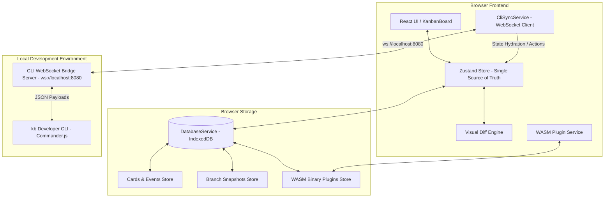

# KanbanLight: A Git-Paradigm Project Management Board with Time-Travel State, WASM Plugins, and a Developer CLI

> **KanbanLight** is an enterprise-grade, local-first project management platform engineered around the distributed version-control paradigm. It combines Git-style branching, visual state diffing, sandboxed WebAssembly (WASM) plugin persistence, local-first AI analytics, and a real-time WebSocket Developer CLI bridge (`kb`).

---

## 🎯 Architecture Diagram



---

## ✨ Core Features

### 🌿 Git-Style Branching & Time-Travel Snapshots
- **Branching Engine**: Create non-destructive feature branches (e.g., `experimental`, `sprint-2`) from any parent state.
- **IndexedDB Snapshots**: Complete board state serialization (`cards`, `columns`, `events`) stored directly in IndexedDB.
- **Instant Hydration**: Switch branches seamlessly with instant UI state replacement and IndexedDB synchronization.

### 🔍 Visual Diffs & Ghost Card Rendering
- **Comparative Diff Engine**: Compare your active branch against any target branch (e.g., `experimental vs main`).
- **Tri-Color Indicator Rings**:
  - **`+ Added`**: Green ring & background tint for cards added in current branch.
  - **`~ Modified`**: Amber ring & background tint for modified/moved cards.
  - **`- Deleted`**: Red dashed ring & opacity-60 ghost cards rendered in their original columns.
- **Floating Banner**: Interactive diff mode banner displaying high-level change statistics with a one-click exit trigger.

### 🧩 WebAssembly (WASM) Plugin Persistence
- **Binary Module Storage**: Native IndexedDB binary storage (`Uint8Array`/`ArrayBuffer`) preserving WASM modules across page reloads.
- **Hook Lifecycle**: Execute sandboxed binary plugins on card creation, moves, and board initialization.
- **Zero LocalStorage Bottlenecks**: Re-compiles `WebAssembly.compile()` directly on app boot.

### 💻 Developer CLI (`kb`) & Live Sync Bridge
- **WebSocket Bridge**: Run `kb serve` to open a local synchronization bridge (`ws://localhost:8080`).
- **Live Terminal Reactivity**: Run CLI commands in a second terminal tab and watch the browser UI instantly compute diffs and switch branches in real time:
  ```bash
  kb branch feature-x -b
  kb compare main
  kb switch main
  ```
- **CLI Badge Indicator**: Real-time "CLI Connected" header badge confirming WebSocket linkage.

### 🤖 Local-First AI Analytics & Insights
- **Workflow Analytics**: Detect bottlenecks, stagnant tasks, and velocity trends.
- **Predictive Completion**: Automated estimation of board completion dates.
- **Smart Card Creator**: AI-assisted card parsing with priority scoring and tag suggestions.

---

## 🚀 Quickstart & Local Setup

### 1. Web Application Setup
```bash
# Clone the repository
git clone https://github.com/vardaanbazaz/kanbanlight.git
cd kanbanlight

# Install dependencies
npm install

# Start the Vite development server
npm run dev
```

### 2. Developer CLI Setup & Live Sync
```bash
# Open a new terminal window inside the repository
cd cli

# Build the CLI TypeScript package
npm run build

# Start the CLI WebSocket Bridge Server
npx tsx src/index.ts serve
# (Output: 🚀 KanbanLight CLI Bridge Server listening on ws://localhost:8080)
```

### 3. Testing Real-Time CLI Commands
Open a second terminal window and run commands:
```bash
# Create and checkout a new branch
npx tsx cli/src/index.ts branch experimental -b

# Add a card from terminal
npx tsx cli/src/index.ts add "Implement WebAssembly Worker Sandbox" -p high -c backlog

# Compare current branch against main in Live UI
npx tsx cli/src/index.ts compare main

# Switch back to main branch
npx tsx cli/src/index.ts switch main
```

---

## 🛠️ Production Build & Deployment

### Build Command
```bash
npm run build
```

The output bundle is written to `dist/`, fully optimized for zero-config deployment to **Vercel**, **Netlify**, or **GitHub Pages**.

---

## 📄 License
MIT License - See [LICENSE](LICENSE) for details.

*Built by [Vardaan Bajaj](https://github.com/vardaanbazaz) - Showcasing advanced full-stack systems engineering, distributed state paradigms, and WebAssembly integration.*
