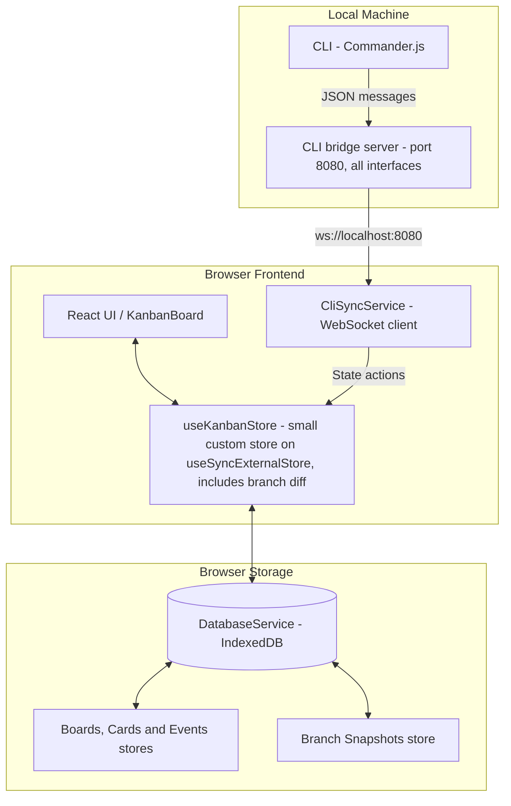

# KanbanLight

Version 0.0.1. KanbanLight is in early development.

Live demo: https://kanbanlight.vercel.app

The CLI bridge requires the local setup below.

KanbanLight is a Kanban board that runs in the browser and borrows a few ideas from Git. You can create branches of a board, switch between them, and compare the active branch with another branch in a visual diff. All data stays in the browser. A small Node.js CLI can send commands to the open board over a local WebSocket bridge.

---

## Features

- **Branches:** create a branch of the board and switch between branches.
- **Per-branch snapshots:** each branch keeps its own snapshot of cards, columns and events, which is loaded when you switch to it.
- **Visual diff:** compare the active branch with another branch. Cards are marked as:
  - **Added:** green ring and tint.
  - **Modified:** amber ring and tint.
  - **Deleted:** red dashed ring, shown faded in their original columns.

  The comparison uses the other branch's last saved snapshot, so changes made on the active branch since that branch's snapshot also show up as differences.
- **Markdown card descriptions**, rendered with `react-markdown` and `remark-gfm`.
- **Command palette**, opened with `Ctrl+K` (`Cmd+K` on macOS).
- **Light and dark mode.** The board follows the system setting until you use the toggle.
- **Local storage:** board data is stored in the browser's IndexedDB. The list of branches is stored in `localStorage`. Nothing is sent to a server.
- **CLI bridge commands:** `serve`, `add`, `branch`, `checkout` / `switch`, `compare` / `diff` and `exit-diff`. See [cli/README.md](cli/README.md).

---

## Architecture


```mermaid
graph TD
    subgraph Browser Frontend
        UI[React UI / KanbanBoard]
        Store[useKanbanStore - small custom store on useSyncExternalStore, includes branch diff]
        CliClient[CliSyncService - WebSocket client]
    end

    subgraph Browser Storage
        IDB[(DatabaseService - IndexedDB)]
        IDB_Cards[Boards, Cards and Events stores]
        IDB_Snapshots[Branch Snapshots store]
    end

    subgraph Local Machine
        WsBridge[CLI bridge server - port 8080, all interfaces]
        CliTool[CLI - Commander.js]
    end

    UI <--> Store
    Store <--> IDB
    IDB <--> IDB_Cards
    IDB <--> IDB_Snapshots
    CliTool -->|JSON messages| WsBridge
    WsBridge -->|ws://localhost:8080| CliClient
    CliClient -->|State actions| Store
```

---

## Tech stack

- **Core:** React 18, TypeScript, Vite
- **State management:** a small custom store on React's `useSyncExternalStore`
- **Styling:** Tailwind CSS, Lucide React icons
- **Local database:** IndexedDB, through the `idb` wrapper
- **CLI:** Node.js, Commander.js, WebSocket (`ws`)

---

## Setup

Requires Node.js and npm. Tested with Node.js 22.

### Terminal 1: web app

```bash
git clone https://github.com/vardaanbazaz/kanbanlight.git
cd kanbanlight
npm install
npm run dev
```

Open the URL that Vite prints.

To make a production build instead:

```bash
npm run build
```

### Terminal 2: CLI bridge (optional)

Read the security note under "Known issues" first. Then, from the `kanbanlight` directory:

```bash
cd cli
npm install
npx tsx src/index.ts serve
```

Leave it running.

### Terminal 3: CLI commands

From the `kanbanlight/cli` directory, with the bridge running and the web app open in a browser:

```bash
npx tsx src/index.ts --help
npx tsx src/index.ts add "Write release notes" -p high -c backlog
npx tsx src/index.ts compare main
npx tsx src/index.ts exit-diff
```

The CLI's help text and messages refer to it as `kb`. In this setup, `kb <command>` means `npx tsx src/index.ts <command>` run from `cli/`.

---

## Known issues

- CLI branch commands (`branch`, `switch`, `compare`) currently work reliably only with `main`; other names can create inconsistent branch state.
- The CLI bridge has no authentication and listens on all network interfaces. Run `serve` only on a trusted network, and stop it when not in use.
- The guided tour shown on first visit has a rendering bug that floods the browser console with warnings.

---

## Roadmap

- **Branch merging with conflict resolution:** in progress. The earlier merge UI did not apply changes and has been removed while merging is rebuilt.
- **WASM plugins:** prototype parked. Upload, storage and loading of `.wasm` files worked, but plugins could not affect the board.
- **Real-time collaboration:** prototype parked. A Yjs document was set up locally, but there was no sync server and board data was never shared.
- **CLI standalone mode:** prototype parked. The CLI kept its own SQLite boards, which never synced with the browser.

The code for the parked prototypes is preserved under the git tag `pre-audit-2026-09`.

---

## License

MIT License. Copyright (c) 2026 Vardaan Bajaj. See [LICENSE](LICENSE) for details.
